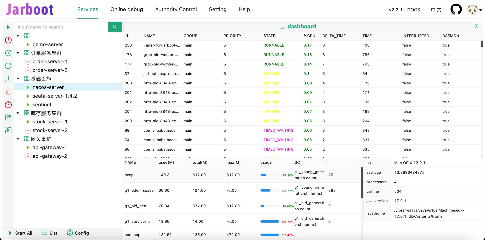

# Jarboot ❤️


[](https://github.com/majianzheng/jarboot/actions/workflows/maven.yml)

[](https://travis-ci.com/majianzheng/jarboot)
[](https://codecov.io/gh/majianzheng/jarboot)

[](http://isitmaintained.com/project/majianzheng/jarboot "Average time to resolve an issue")
[](http://isitmaintained.com/project/majianzheng/jarboot "Percentage of issues still open")

<code>Jarboot</code> 是一个Java进程启动器，可以管理、监控及诊断一系列的Java进程。

在测试环境、每日构建的集成环境，可以把一系列编译输出等jar文件放入约定的目录，由<code>Jarboot</code>提供友好的浏览器ui界面和<code>http</code>接口，统一管理它的启动、停止及状态的监控，以及执行命令对目标进程进行调试。

English version goes [here](README.md).


## 技术背景及目标
<code>Jarboot</code> 使用<code>Java Agent</code>和<code>ASM</code>技术往目标Java进程注入代码，无业务侵入性，注入的代码仅用于和<code>Jarboot</code> 的服务实现命令交互，部分命令会修改类的字节码用于类增强，加入了与<code>Arthas</code>类似的命令系统，如获取JVM信息、监控线程状态、获取线程栈信息等。

- 🌈   浏览器界面管理，一键启、停服务进程，不必挨个手动执行
- 🔥   支持启动、停止优先级配置<sup id="a2">[[1]](#f1)</sup>，默认并行启动
- ⭐️   支持进程守护，开启后若服务异常退出则自动启动并通知
- ☀️   支持文件更新监控，开启后若jar文件更新则自动重启<sup id="a3">[[2]](#f2)</sup>
- 🚀   调试命令执行，同时远程调试多个Java进程，界面更友好

采用<code>前后端分离</code>架构，前端界面采用<code>React</code>技术，脚手架使用<code>Umi</code>，组件库使用Umi内置等<code>antd</code>。后端服务主要由<code>SpringBoot</code>实现，提供http接口和静态资源代理。通过<code>WebSocket</code>向前端界面实时推送进程信息，同时与启动的Java进程维持一个长连接，以监控其状态。

## 安装或编译构建
1. 编译前端项目和<code>Java</code>，或者<a href="https://repo1.maven.org/maven2/io/github/majianzheng/jarboot-packaging/" target="_blank">下载</a>发布的zip安装包
```bash
#编译前端
cd jarboot-ui
#首次时需要先安装依赖，执行yarn或npm install
yarn

#执行编译，yarn build或npm run build，开发模式可执行yarn start或npm run start
yarn build

#切换到代码根目录，编译Java代码
cd ../
mvn clean install
```

2. 安装后的目录结构

```bash
jarboot                             #当前工作目录
├─logs                              #日志
├─jarboot-spy.jar
├─jarboot-agent.jar                 
├─jarboot-core.jar                  
├─jarboot-service.jar               #Web服务HTTP接口及WebSocket及主要业务实现
│
├─services                          #约定的管理其他jar文件的默认根目录(可配置)
│  ├─demo1-service                  #服务名为目录, 目录下存放启动的jar文件及其依赖
│  │   └─demo1-service.jar          #启动的jar文件, 若有多个则需要在[服务配置]界面配置启动的jar文件, 否则可能会随机选择一个
│  └─demo2-service                  
│      └─demo2-service.jar
└─static                            #前端界面资源位置
   ├─index.html                     
   ├─umi.css                        
   └─umi.js                         
```
后端服务启动会指定一个管理其他启动jar文件的根路径（默认为当前路径下的services，可在【服务配置】界面配置），在此根目录下创建每个服务目录，创建的 ***目录名字为服务名*** ，在创建的目录下放入jar包文件，详细可见上面的目录结构约定。

3. 启动<code>jarboot-service.jar</code>主控服务
```bash
#执行 boot.sh 启动, 在Windows系统上使用boot.bat。
./boot.sh
```

4. 浏览器访问<http://127.0.0.1:9899>

## 命令列表
### bytes
查看类的字节码，用法：
```bash
jarboot$ bytes com.mz.jarboot.demo.DemoServerApplication
ClassLoader: org.springframework.boot.loader.LaunchedURLClassLoader@31221be2
------
getUser
L0
LINENUMBER 27 L0

...

ILOAD 1
ILOAD 2
IADD
IRETURN
L8
```

### stdout
开启或关闭标准输出流的实时显示（初始为关闭），将会在Web的前端ui界面上实时显示，输出流包括代码中的<code>System.out.println</code>、<code>System.err.println</code>
以及日志打印信息如<code>logger.info("hello")</code>。

注意：当你的程序日志输出太频繁时，开启显示会比较消耗性能，建议仅在需要时打开，用完后关闭。
```bash
#开启标准输出流实时显示
jarboot$ stdout on

#关闭标准输出流实时显示
jarboot$ stdout off
```
  
### dashboard
当前系统的实时数据面板，点击按钮取消


  
### jad 
反编译

```bash
jarboot$ jad [-c] java.lang.String
````


### jvm
查看进程JVM属性信息

```bash
jarboot$ jvm
````
  
### trace
方法执行监控 
```bash
jarboot$ trace com.mz.jarboot.demo.DemoServerApplication add 
Affect(class count: 2 , method count: 1) cost in 63 ms, listenerId: 2
`---ts=2021-06-15 23:34:20;thread_name=http-nio-9900-exec-3;id=13;is_daemon=true;priority=5;TCCL=org.springframework.boot.web.embedded.tomcat.TomcatEmbeddedWebappClassLoader@4690b489
    `---[0.053485ms] com.mz.jarboot.demo.DemoServerApplication:add()
```
  
### watch
方法执行数据监测
    
观察方法 `com.mz.jarboot.demo.DemoServerApplicatio#add` 执行的入参，仅当方法抛出异常时才输出。

```bash
jarboot$ watch com.mz.jarboot.demo.DemoServerApplicatio add {params[0], throwExp} -e
Press Ctrl+C to abort.
Affect(class-cnt:1 , method-cnt:1) cost in 65 ms.
ts=2018-09-18 10:26:28;result=@ArrayList[
    @RequestFacade[org.apache.catalina.connector.RequestFacade@79f922b2],
    @NullPointerException[java.lang.NullPointerException],
]
```
  
### thread
查看当前线程信息，查看线程的堆栈

```bash
jarboot$ thread -n 3
"nioEventLoopGroup-2-1" Id=31 cpuUsage=0.37% deltaTime=0ms time=880ms RUNNABLE
    at sun.management.ThreadImpl.dumpThreads0(Native Method)
    at sun.management.ThreadImpl.getThreadInfo(ThreadImpl.java:448)
    at com.mz.jarboot.core.cmd.impl.ThreadCommand.processTopBusyThreads(ThreadCommand.java:209)
    at com.mz.jarboot.core.cmd.impl.ThreadCommand.run(ThreadCommand.java:120)
    at com.mz.jarboot.core.basic.EnvironmentContext.runCommand(EnvironmentContext.java:162)
    at com.mz.jarboot.core.cmd.CommandDispatcher.execute(CommandDispatcher.java:35)
    at com.mz.jarboot.core.server.JarbootBootstrap$1.onText(JarbootBootstrap.java:94)
    at com.mz.jarboot.core.ws.WebSocketClientHandler.channelRead0(WebSocketClientHandler.java:83)
    at io.netty.channel.SimpleChannelInboundHandler.channelRead(SimpleChannelInboundHandler.java:99)

"C2 CompilerThread1" [Internal] cpuUsage=3.14% deltaTime=6ms time=4599ms


"C2 CompilerThread0" [Internal] cpuUsage=2.28% deltaTime=4ms time=4692ms
```

### sysprop
查看进程系统属性信息

```bash
#获取全部
jarboot$ sysprop
#获取指定的属性
jarboot$ sysprop user.home
```
  
### 更多强大的指令在持续开发中...

---
## Credit
### Projects

* [bytekit](https://github.com/alibaba/bytekit) Java Bytecode Kit.
* [Arthas](https://github.com/alibaba/arthas) 部分命令在<code>Arthas</code>源码的基础上二次开发。

## 仓库镜像

* [码云Jarboot](https://gitee.com/majz0908/jarboot)

---
<span id="f1">1[](#a1)</span>: 可以配置优先级级别，从整数值1开始，越大约先启动，停止的顺序则相反，默认为1。<br>
<span id="f2">2[](#a2)</span>: 开发中可以由<code>gitlab runner</code>、<code>Jenkins</code>等工具自动构建后通过脚本拷贝到Jarboot指定的目录下，Jarboot监控到文件的更新会自动重启服务，目录监控实现了<code>防抖设计</code>（在一定时间内的多次更新只会触发一次重启）。
